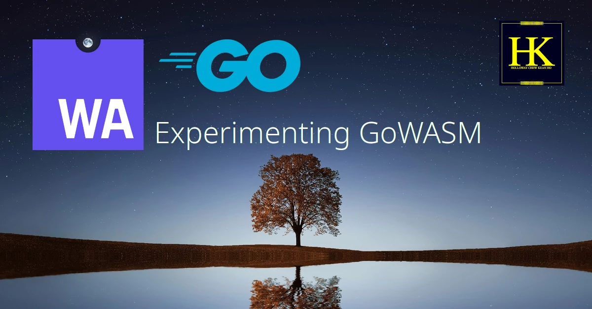

# Holloway's GoWASM Experiments


This is the principle repository for (Holloway) Chew, Kean Ho's experimentation
to develop a pure Go web application supporting
[Progressive Web Application](https://web.dev/progressive-web-apps/) offline
mode alongside using pure Go to develop web application entirely.


## Experiemntation Goals
The goal of unifying web application development for client-side rendering using
a proper programming language like [Go](https://go.dev/) has been aspired but
low implementations due to little efforts. That's why the primary goal is to:

1. Develop the foundational Go library so that the customers (Go web developer)
   to deploy web app.
   1. **[ DONE ]** - Power on with `ExperimentingGoWASM` Go workspace with
      `vendor/hestiaGo` and `vendor/presentoGo` packages.
   2. **[ DOING ]** - Develop Monteur's test, build, package, and release
      recipes for GoWASM.
   3. Develop baseline foundation for using GoWASM.
   4. Develop `<body>` manipulations directly in GoWASM (output).
   5. Develop `<body>` manipulations directly in GoWASM (input).
   6. Develop `<body>` manipulations directly in GoWASM (event-driven).
   7. Explore and conclude the necessity of using [TinyGo](https://tinygo.org/).
2. Develop client-side rendering capability using [Hugo](https://gohugo.io/) for
   cost reduction between the server sides and the end-user sides.
   1. **[ DONE ]** - Power on with Presento Theme with NoCSS but rendering
      capabilities.
   2. Develop necessary partial functions to isolate Hugo functions (prevent
      vendor locked-in).
   3. Develop plain HTML+Javascript pages necessary to bring up Go-WASM.
   4. Power on Go-WASM+HTML+Javascript on Hugo.
   5. Deploy Gunzip against Go-WASM to reduce its size with Monteur.
   6. Develop necessary foundation for Go-WASM client-side rendering.
3. Develop the necessary CSS/Sass frontend rendering libraries to keep the
   foundation reasonably and visually appealing at minimum.
   1. Analyize (1) and (2) to see exactly where to develop the CSS/Sass
      and why. Make sure it's documentable.
   2. Develop the core component to render the page without device screen
      locking.
4. Use scalable tools that can roll out updates for multiple technologies
   modularly and without much fears.
   1. **[ DONE ]** - deployed ZORALab's Monteur to manage the repository
      systematically, customizable at scale.
   2. **[ DONE ]** - deployed Hugo Themes module to manage Hugo specific and
      scalable setup.


## 3rd-Party Dependencies
Here are the list of 3rd-party dependencies used so far:

1. ZORALab's Monteur - https://monteur.zoralab.com
2. Go - https://go.dev
3. Hugo - https://gohugo.io/
4. GolangCI-Lint - https://golangci-lint.run/


## (1) Utilize Local CI - Monteur
The FIRST technology chosen was [ZORALab's Monteur](https://monteur.zoralab.com)
to manage the repository development continuously and controls with confidences
when deploying the repository in a decentralized manner.

The first step you need to do would be installing Monteur as per instructed in
their official website.

Once the `monteur` program is available, proceed to your own copy and perform:

```bash
$ monteur setup
```

Monteur shall setup all the repository's dependencies and configurations
seamlessly. Repeat this `monteur setup` command whenever there is an update from
Monteur Setup Job recipes OR something went wrong with the current setup in
your repository.


## (2) Local Development
The second step is to bring up your local development. Monteur setup local
filesystem inside the repository. Hence, whenever you open a new terminal to
wanting to develop this repository, simply do the following:

```bash
$ source .monteurFS/config/main
```

Once done, the terminal you're in is now configured to be repository specific.
You're now ready to develop the repository. All instructions beyond this step
**assumes you always this step**.

> **NOTE**
>
> Whenever you find any software that is missing in action, you're likely
> forgotten this step.


## (3) Local Hosting Hugo
The SECOND technology selected was `hugo` for simple static site generations.
The repository is designed in a way that it can operate in offline or bad
connectivity environments. To do that, execute:

```
.configs/hugo/server.cmd
```

Once done, please visit the URL site presented in the terminal. The default
is: http://localhost:8080

If you need to work on something else, you need to setup a new terminal again.


## (4) GoWASM Go Workspace
The THIRD technologies selected were `go` and `golangci-lint` for their
simplicity and portability sake. In order to work on the Go project, you need
to open a new terminal, perform the Step (2) for it, and then change directory
into `wasmExpGo`. That is the root location of the Go source codes and its
workspace.

```
cd wasmExpGo
```

While the workspace is for this repository, the file structures are arranged
into 3 different Go `modules`: `wasmExpGo`, `hestiaGo`, and `presentoGo`. The
minimal file structure is as follows:

```
.
├── app
│   └── wasm
│       └── main.go
├── go.mod
├── hestiaGo
│   ├── go.mod
│   └── version.go
└── presentoGo
    ├── go.mod
    └── version.go
```

Each module has its specific roles to prevent vendor locked-in threat while
maintaining Go's quality in package modularlities. They key roles are:

1. `wasmExpGo` - the repository specific packages.
2. `hestiaGo` - the common library packages that will be upstreamed to:
   https://github.com/ZORALab/Hestia
3. `presentoGo` - the frontend UI rendering packages that will be upstreamed to:
   https://github.com/ZORALab/Presento

To prevent supply-chain nightmare from affecting any project, `go.mod` plays a
critical role here to make sure all the source codes know where to find the
packages.

Generally speaking, all import statements **SHALL use the `replace` clause**
to denote its sourcing navigations. Here is a simple example:

```
// Copyright 2022 "Holloway" Chew, Kean Ho <hollowaykeanho@gmail.com>
//
// Permission is hereby granted, free of charge, to any person obtaining a copy
// of this software and associated documentation files (the "Software"), to
// deal in the Software without restriction, including without limitation the
// rights to use, copy, modify, merge, publish, distribute, sublicense, and/or
// sell copies of the Software, and to permit persons to whom the Software is
// furnished to do so, subject to the following conditions:
//
// The above copyright notice and this permission notice shall be included in
// all copies or substantial portions of the Software.
//
// THE SOFTWARE IS PROVIDED "AS IS", WITHOUT WARRANTY OF ANY KIND, EXPRESS OR
// IMPLIED, INCLUDING BUT NOT LIMITED TO THE WARRANTIES OF MERCHANTABILITY,
// FITNESS FOR A PARTICULAR PURPOSE AND NONINFRINGEMENT. IN NO EVENT SHALL THE
// AUTHORS OR COPYRIGHT HOLDERS BE LIABLE FOR ANY CLAIM, DAMAGES OR OTHER
// LIABILITY, WHETHER IN AN ACTION OF CONTRACT, TORT OR OTHERWISE, ARISING
// FROM, OUT OF OR IN CONNECTION WITH THE SOFTWARE OR THE USE OR OTHER
// DEALINGS IN THE SOFTWARE.

package main

import (
	"fmt"
	"hestiaGo"
	"presentoGo"
)

func main() {
	fmt.Printf("Hello World\n")
	fmt.Printf("Hestia Version: %s\n", hestiaGo.VERSION)
	fmt.Printf("Presento Version: %s\n", presentoGo.VERSION)
}
```

Notice that both `hestiaGo` and `presentoGo` are not imported using
`github.com/hollowaykeanho/...`. Instead, they are using their navigator.

Then in `wasmExpGo`'s `go.mod`, it has replace clauses as follows:

```
module github.com/hollowaykeanho/ExperimentingGoWASM/wasmExpGo

go 1.18

replace (
	github.com/hollowaykeanho/ExperimentingGoWASM/wasmExpGo => ./
	hestiaGo => ./hestiaGo
	presentoGo => ./presentoGo
	wasmExpGo => ./
)
```

The `module` clause remains as default since we want to maintain `go get`
capability. However, in source codes, we use `wasmExpGo` instead just like the
other 2.

Then, in each 3rd-party libraries, their modules are in accordance to their
respective `go.mod` settings:

```
module https://github.com/ZORALab/Hestia/hestiaGo

go 1.18

replace (
	github.com/ZORALab/Hestia/hestiaGo => ./
	hestiaGo => ./
)
```


## (5) Testing Go Workspace
With Monteur Test CI Job made available, given the correct recipe, Monteur
can perform either pinpoint or recursive testing against Go packges. All the
user needs to do is:

```
$ monteur test
```

And then all the necessary result data files are generated into the package
directory itself.


## (6) Building Go WASM
With Monteur Build CI Job made available, given the correct recipe, Monteur
can peform percise Go build in a reproducible manner. All the user needs to do
is:

```
$ monteur build
```


## (7) Package Go WASM
With Monteur Package CI Job made available, given the correct recipe, Monteur
can peform proper packaging in a reproducible manner. All the user needs to do
is:

```
$ monteur package
```


## License
The repository is licensed under MIT License.
